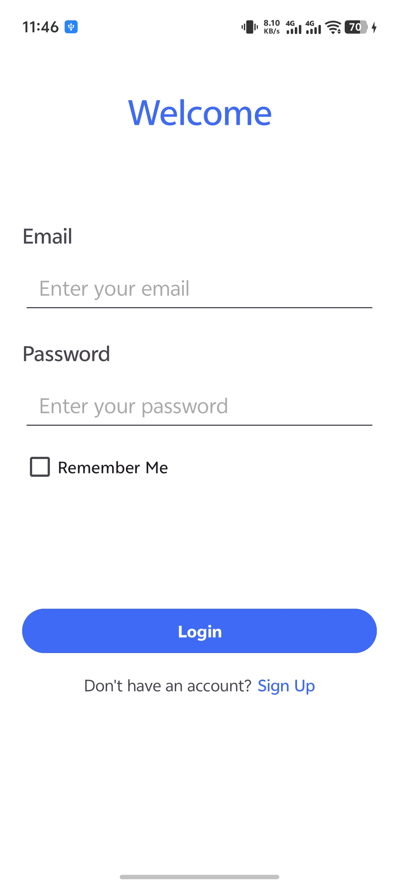
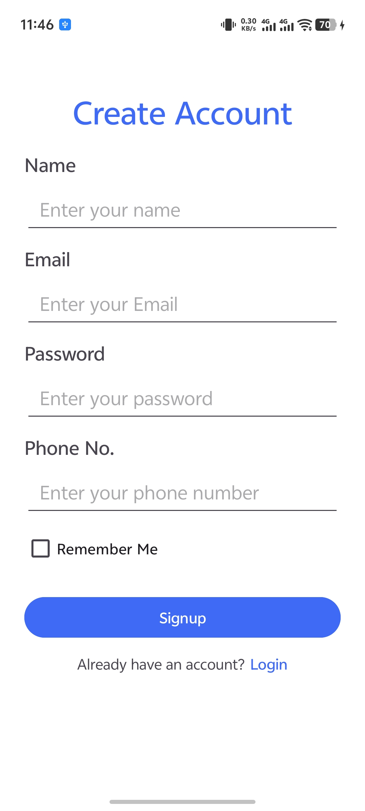
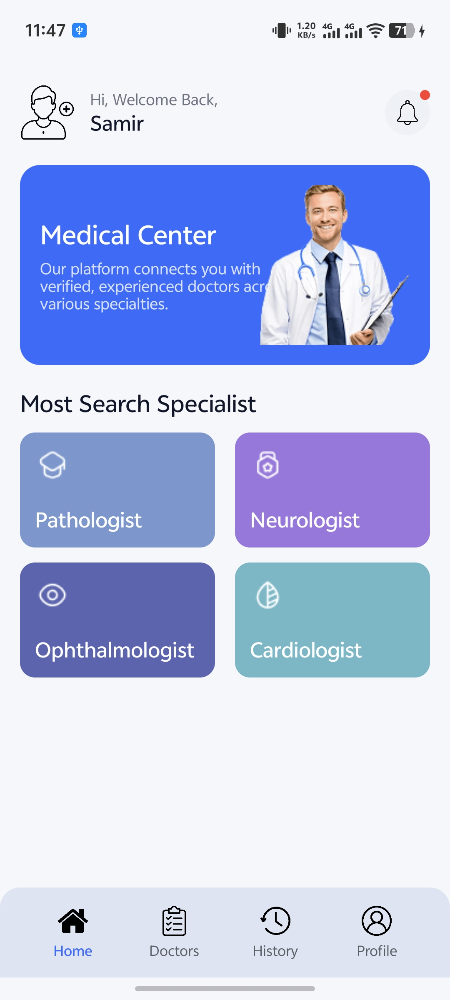
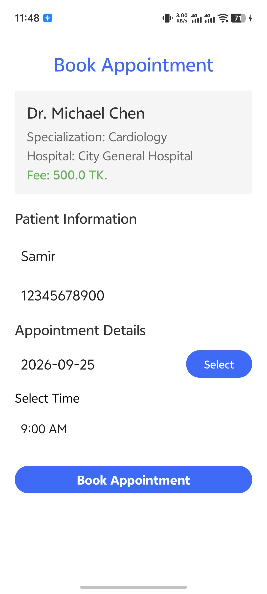
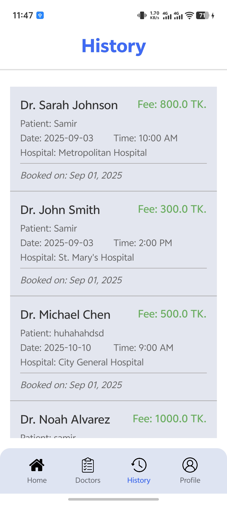
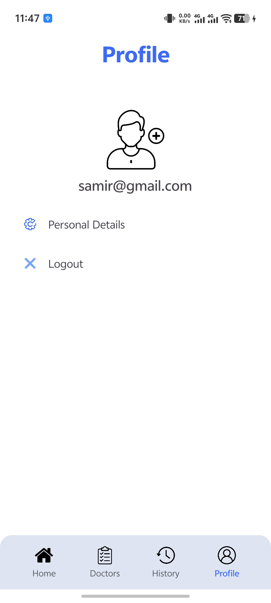
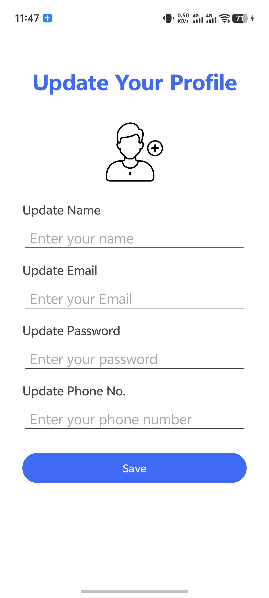

# DocTalk

A simple Android app for finding doctors and booking appointments.


## Download

[](https://github.com/SamirHossain2001/DocTalk_App/releases/download/v1.0/app-debug.apk)

Install on an Android phone, then allow installing from unknown sources when prompted.

## Screenshots

<p align="center">
  
  
  
  
</p>
<p align="center">
  
  
  
  
</p>

## Features

- Sign up and log in with an account saved on the device, with a remember me option
- Browse doctors loaded from Firebase Realtime Database
- Book appointments by picking a date and time
- View appointment history
- View and update your profile
- Reminder notification at 9 AM the day before an appointment

## Tech Stack

- Java and the Android SDK (min SDK 24, target SDK 36)
- Firebase Realtime Database
- Glide for image loading
- SharedPreferences for the on-device account and session
- AlarmManager and BroadcastReceiver for reminders

## Build and Run

1. Clone this repository.
2. Open the project in Android Studio.
3. Add your own `google-services.json` file inside the `app/` folder to connect Firebase.
4. Run the app on a device or emulator with Android 7.0 or newer.

## Project Structure

```
DocTalk/
├── app/
│   └── src/main/
│       ├── AndroidManifest.xml
│       ├── java/edu/ewubd/cse489/group7/doctalk/
│       │   ├── MainActivity.java          # Home screen
│       │   ├── LoginActivity.java         # Login
│       │   ├── SignupActivity.java        # Signup
│       │   ├── ProfileActivity.java       # View profile
│       │   ├── UpdateProfileActivity.java # Edit profile
│       │   ├── DoctorList.java            # Doctor list from Firebase
│       │   ├── BookingActivity.java       # Book an appointment
│       │   ├── History.java               # Appointment history
│       │   ├── UserManager.java           # Session storage
│       │   ├── adapters/                  # ListView adapters
│       │   ├── models/                    # Doctor and Appointment models
│       │   └── services/                  # Notifications and reminders
│       └── res/
│           ├── layout/                    # Screen layouts
│           ├── values/                    # Colors, strings, themes
│           └── drawable/                  # Icons and backgrounds
├── github_assets/                         # Screenshots for this README
└── build.gradle.kts
```

## License

Released under the MIT License.
